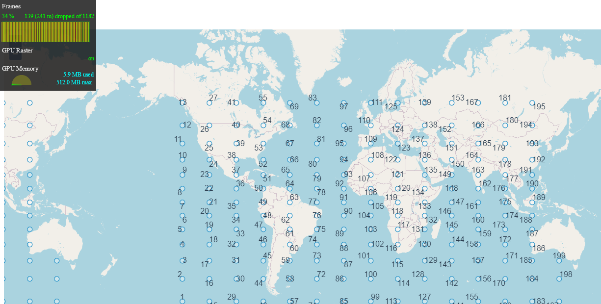
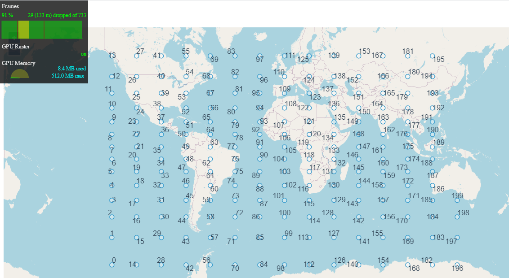
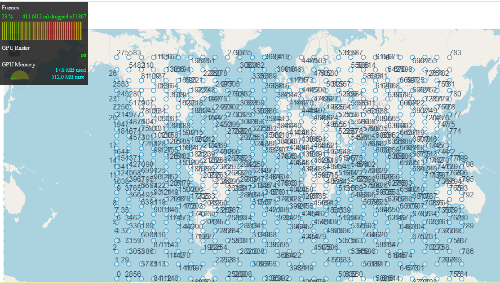

# fast-overlay

Based on Openlayers@5.3.3. Optimize 'Overlay' performance, inspired by a openlayers issue.

On my computer(cpu:inter 8250u,16G),the test results are show as follow:

The result of adding 200 points using Openlayers Overlay.



The result of add 200 and 800 points using FastOverlay.





## Project setup
```
npm install
```

### Compiles and hot-reloads for development
```
npm run serve
```

### Compiles and minifies for production
```
npm run build
```

### Run your unit tests
```
npm run test:unit
```

### Lints and fixes files
```
npm run lint
```

### Customize configuration
See [Configuration Reference](https://cli.vuejs.org/config/).
